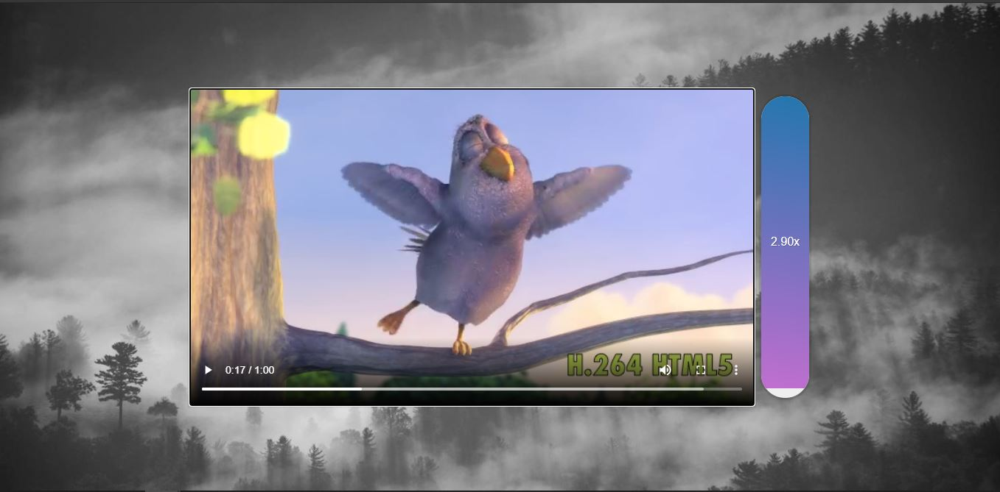

# video-speed-scrubber

This is project 28 in Wes Bos' JavaScript 30 course.  In this lesson we built a click and drag function which speeds up and slows down the HTML video player.  I only made one small change from the tutorial, Wes used 'mousemove' which I found a little unfriendly as the user, so I changed it to 'mousedown,' which I felt made it a little friendlier.  If you're interested in doing it yourself, you can find the video <a href="https://www.youtube.com/watch?v=8gYN_EDMg_M">here.</a>

